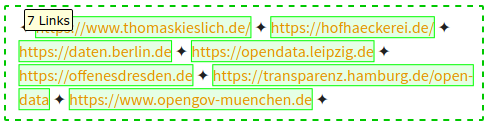

.. include:: /Includes.txt
.. _start:

===============================
Tell Me Something About Topic X
===============================

Rendered: |today|

:Title:        Tell Me Something About Topic X
:Authors:      TYPO3 Documentation Team
:Maintainer:   Martin Bless <martin.bless@typo3.org>
:Description:  Frequently searched topics with explanations and links
:Published at: `docs.typo3.org/m/typo3/guide-tell-me-something-about/master/en-us
               <https://docs.typo3.org/m/typo3/guide-tell-me-something-about/master/en-us/>`__
:Repository:   `github.com/TYPO3-Documentation/TYPO3CMS-TellMeSomethingAbout
               <https://github.com/TYPO3-Documentation/TYPO3CMS-TellMeSomethingAbout/>`__
:License:      `CC BY-NC-SA 4.0 <https://creativecommons.org/licenses/by-nc-sa/4.0/>`__

This manual is part of official TYPO3 documentation.

.. Do not use headlines on this page as we have a .. toctree::
   at the end of this page.

--------------------------------------------------

**What is this?**

•  intended to be of help for developers -- when you would otherwise do a
   general internet research
•  quickly find some interesting starting points
•  a collection of pointers, structured by topics
•  a list of topics with their names in TYPO3 context
•  a place to keep search results
•  a curated list
•  a time saver for you - hopefully!

.. // http://www.graphviz.org/doc/info/attrs.html
   // http://www.graphviz.org/doc/info/attrs.html#k:escString
   // http://www.graphviz.org/doc/info/attrs.html#k:shape
   // https://en.wikipedia.org/wiki/DOT_(graph_description_language)#General
   // https://graphs.grevian.org/example
   // https://graphviz.org/doc/info/lang.html
   // https://graphviz.org/pdf/dotguide.pdf
   // https://manpages.debian.org/testing/graphviz/dot.1.en.html
   // https://renenyffenegger.ch/notes/tools/Graphviz/examples/index

.. graphviz::
   :caption: Structuring knowledge by topics. Note there are tooltips. Some
             nodes have operational hyperlinks.

   digraph Knowledge_by_topics  {
   layout=neato;
   ratio="0.6"
   // size="8.27,11.69"; // 210mmx297mm
   graph[label="",labelloc="t",tooltip="Structuring knowledge by topics",bgcolor="#f0f0f0"];
   node [fontsize = 14, style = solid];

   Looking_for [label="Looking for …",fillcolor=white,shape=rectangle,style="dashed,filled",tooltip="Suppose you are trying to find out about a topic …"];

   node [fontsize=12,style=filled,width=.75,height=.50];

   Looking_for -> Your_topic;
   Looking_for -> CKEditor;
   Looking_for -> Deployment;
   Looking_for -> Sitepackages;
   Looking_for -> More;

   node[fontsize=10,margin=".05",width=.75,height=.40,shape=ellipse,style=filled,fillcolor=white]

   CKEditor -> CKEditor_blogpostings;
   CKEditor -> CKEditor_official_docs;
   CKEditor -> CKEditor_onlinetryouts;

   Deployment -> Deployment_blog_postings;
   Deployment -> Deployment_clever_solutions;
   Deployment -> Deployment_tools;

   More -> More_best_practise;
   More -> More_resources;

   Sitepackages -> Sitepackages_tutorials;
   Sitepackages -> Sitepackages_videos;

   CKEditor               [                       href="../Topics/Ckeditor.html"                       ,target=_top,tooltip="CKEditor"];
   CKEditor_blogpostings  [label="Blog postings" ,href="../Topics/Ckeditor.html#blog-postings"         ,target=_top,tooltip="CKEditor: Blog postings"];
   CKEditor_official_docs [label="Official docs" ,href="../Topics/Ckeditor.html#official-documentation",target=_top,tooltip="CKEditor: Official documentation"];
   CKEditor_onlinetryouts [label="Online tryouts",href="../Topics/Ckeditor.html#online-tryouts"        ,target=_top,tooltip="CKEditor: Online tryouts"];

   Deployment                  [                         href="../Topics/Deployment.html"                 ,target=_top,tooltip="Deployment"];
   Deployment_blog_postings    [label="Blog postings"   ,href="../Topics/Deployment.html#blog-postings"   ,target=_top,tooltip="Deployment: Blog postings"];
   Deployment_tools            [label="Tools"           ,href="../Topics/Deployment.html#tools"           ,target=_top,tooltip="Deployment: Tools"];
   Deployment_clever_solutions [label="Clever solutions",href="../Topics/Deployment.html#clever-solutions",target=_top,tooltip="Deployment: Cever solutions"];

   More               [label="More…"        ,tooltip="There are more topics in this manual"];
   More_best_practise [label="Best practise",tooltip="More: Best practise"];
   More_resources     [label="Resources"    ,tooltip="More: Resources"];

   Sitepackages           [                  href="../Topics/Sitepackages.html"           ,target=_top,tooltip="Sitepackages"];
   Sitepackages_tutorials [label="Tutorials",href="../Topics/Sitepackages.html#tutorials" ,target=_top,tooltip="Sitepackages: Tutorials"];
   Sitepackages_videos    [label="Videos"   ,href="../Topics/Sitepackages.html#videos"    ,target=_top,tooltip="Sitepackages: Videos"];

   Your_topic             [label="Your topic…", tooltip="This can be your topic - if you contribute"];

   node [label="",shape=point,width=.1,height=.1];

   CKEditor     -> CKEditor_more;
   Deployment   -> Deployment_more;
   More         -> More_more;
   Sitepackages -> Sitepackages_more;
   Your_topic   -> Your_topic_more_1;
   Your_topic   -> Your_topic_more_2;
   Your_topic   -> Your_topic_more_3;
   Your_topic   -> Your_topic_more_4;
   Your_topic   -> Your_topic_more_5;

   Deployment_more   [label = "", tooltip = "Deployment: More…"];
   More_more         [label = "", tooltip = "More: …"];
   Your_topic_more_1 [label = "", tooltip = "More…"];
   Your_topic_more_2 [label = "", tooltip = "More…"];
   Your_topic_more_3 [label = "", tooltip = "More…"];
   Your_topic_more_4 [label = "", tooltip = "More…"];
   Your_topic_more_5 [label = "", tooltip = "More…"];

   CKEditor_more          [label=""                                                                                ,tooltip="CKEditor: More…"];
   Sitepackages_more      [label=""                                                                   ,tooltip="Sitepackages: More…"];

   }

--------------------------------------------------

**What this is NOT**

•  there's no garantee that given links are still valid
•  there's no garantee that linked content is perfectly correct and up to date
•  there's no garantee that all important content is linked

--------------------------------------------------

**Doesn't seem very complete and up to date?**

Well - you can change that.

Up to now only a very few people have done a - very - little bit of contribution
here. Can you imagine how useful this could be if YOU would add your knowledge
and search results too? As a developer we often find ourselves with a special
topic in the foreground of our thinking. That's the moment when we start
internet search: Shop solutions, security, performance, caching for example.
Very useful information about those topics can be found in the internet in form
of slideshows, videos, tutorials or blog posts. While it would be very
desirable to make that information part of the official documentation in
practice this often is not feasable. This manual is an attempt to make such
external information accessible. It can be seen as an enhanced "curated list".

--------------------------------------------------

**How to get your stuff presented here as well**

Best way
   Use the "Edit" button at the top of the page and file a pull request.
   See also :ref:`How to contribute <h2document:docs-contribute>`. Pull
   requests have the highest chance of being treated soon.

Second best way
   Create a new `issue at Github
   <https://github.com/TYPO3-Documentation/TYPO3CMS-TellMeSomethingAbout/issues>`_.
   Expect issues to be dealt with somewhat soon.

Worst way
   Send an `email
   <documentation@typo3.org?subject=TellMeSomethingAboutTopicX>`__ with subject
   'TellMeSomethingAboutTopicX'. In the email make yourself understood. Don't
   expect an email reply. Your suggestion may or may not be integrated in the
   manual. If accepted, somebody will probably create an issue for you.

IF IN DOUBT
   It is better to take any of those actions and to do something than doing
   nothing. Your message doesn't have to be perfect.

--------------------------------------------------

**Tip: Easily open many links**

Get yourself a browser extensions that lets you mark a block of text to open
all links in there in one go. Many links in this manual are written in a very
compact form to facilitate this procedure.

   Using FireFox addon 'Snap Links'

--------------------------------------------------

**Contents:**

.. toctree::

   Topics/Index
   About/Index
   Sitemap/Index
   Linktargets/Index
   genindex
