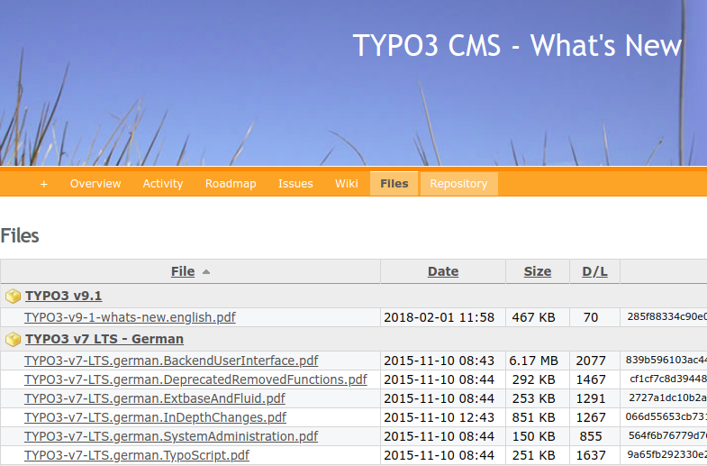

.. include:: /Includes.txt
.. special chars for copy and paste: • ✦
.. _tmsa-Whats-new-in-TYPO3:

====================
What's new in TYPO3?
====================

.. contents::
   :local:
   :backlinks: top

Description
===========

Every TYPO3 release (except bugfix releases) comes with new features, changes
and improvements. Due to the number of changes, it is sometimes not easy to
keep track.

The following resources can be used to learn what's new in each TYPO3 release.

Search
======

Search for:
✦
`typo3+"what's new"
<https://www.startpage.com/do/dsearch?query=typo3+%22what%27s+new%22>`__
✦

Changes
=======

•  `TYPO3 CMS Core ChangeLog
   <https://docs.typo3.org/c/typo3/cms-core/master/en-us/>`__

Release notes
=============

•  `Release notes
   <https://get.typo3.org/release-notes/>`__
   of the latest TYPO3 version

Blog postings
=============

•  2020-04-10 t3terminal:
   `TYPO3 v10 Series 5: 40+ Enhancement in TYPO3 v10 for Developers
   <https://t3terminal.com/blog/40-enhancement-in-typo3-v10-for-developers-series-5/>`__

•  2020-03-28 t3terminal:
   `TYPO3 v10 Series 4: 21 Limelights in TYPO3 v10 for Integrators
   <https://t3terminal.com/blog/21-limelights-in-typo3-v10-for-integrators-series-4/>`__

•  2020-03-19 t3terminal:
   `TYPO3 v10 Series 3: 7 Highlights for Administrators
   <https://t3terminal.com/blog/7-highlights-for-administrators-in-typo3-v10-series-3/>`__

•  2020-03-12, t3terminal:
   `TYPO3 v10 Series 2: 10 Spotlights for Editors
   <https://t3terminal.com/blog/10-spotlights-for-editors-in-typo3-v10-series-2/>`__

•  2020-03-05, t3terminal:
   `TYPO3 v10 Series 1: Get Prepared for TYPO3 v10 - Before It’s Release
   <https://t3terminal.com/blog/get-prepared-for-typo3-v10-before-its-release/>`__

•  2018-02-04, Marcus Schwemer:
   `TYPO3 sprint releases 9.0 and 9.1 — The main changes
   <https://typo3worx.eu/2018/02/typo3-v91-main-changes/>`__

What's New Slides
=================

.. figure:: files/WhatsNewInTypo3-450.png
   :target: https://typo3.org/help/documentation/whats-new/
   :alt:    Teaser What's new in TYPO3 v9.1?
   :class:  with-shadow
   :scale:  50 %

   TYPO3 CMS - What's New Slides (click image)

Archive of "What's New Slides"
==============================

   Archive: What's New Slides (click image)
